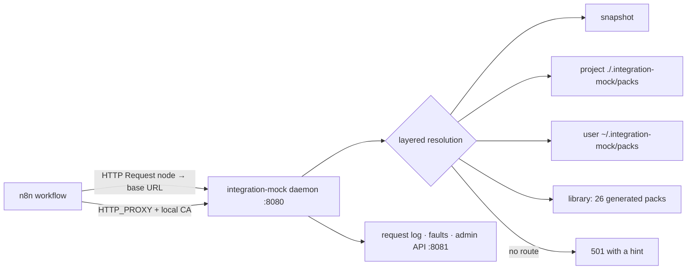

# integration-mock

> A local mock of the APIs your workflow's integrations call, generated from OpenAPI or recorded from real runs. n8n is the first supported platform.

[](https://github.com/LudwigGerdes/integration-mock/actions/workflows/ci.yml)
[](LICENSE)
[](#compatibility)


<details><summary>Text transcript</summary>

```
$ integration-mock start
proxy started on :8080 (admin :8081)

$ integration-mock packs enable weather
enabled: weather

$ integration-mock url weather
http://127.0.0.1:8080/weather

$ curl -i http://127.0.0.1:8080/weather/dev/weather
HTTP/1.1 200 OK
content-type: application/json

{"city":"Evanston","tempC":14,"summary":"cloudy","source":"integration-mock"}

$ curl http://127.0.0.1:8080/weather/nope
{"error":"integration-mock: no route","service":"weather","method":"GET","path":"/nope",
 "hint":"run `integration-mock record` or add to ./.integration-mock/packs/weather"}

$ integration-mock log
2026-09-14T06:42:24.559Z	GET	weather	/dev/weather	200	weather:GET:/dev/weather#0
2026-09-14T06:42:24.659Z	GET	weather	/nope	501	unmatched
```
</details>

## Why

Every HTTP Request node and every native integration node in an n8n workflow calls a real service, so testing a workflow means real side effects, real rate limits and a real API key you may not have yet. That makes iteration slow — you re-send the Slack message, you burn the Stripe sandbox quota, or you cannot run the workflow at all until access arrives. integration-mock stands in for those services on your machine: it serves vendor packs generated from OpenAPI or recorded from one real run, answers every unmocked call with a loud 501, and never lets a request reach the vendor.

## Quickstart

Nothing is sent anywhere. From npm, one self-contained package, no build step:

```
$ npx integration-mock start          # or: npm install -D integration-mock
proxy started on :8080 (admin :8081)

$ npx integration-mock packs enable slack
enabled: slack

$ curl -X POST http://127.0.0.1:8080/slack/api/oauth.access
{"access_token":"mock-access-token","token_type":"Bearer", …}

$ npx integration-mock stop
stopped
```

The package carries the daemon, eight core packs (`packs list` shows them; `packs install <id>` downloads the rest), the JSON Schemas, the compose pair behind `up`/`down` and the authoring skill. It is a CLI: there is no programmatic API to import.

From a checkout:

```bash
git clone https://github.com/LudwigGerdes/integration-mock.git && cd integration-mock
pnpm install && pnpm build            # ~1 s and ~10 s; the "Ignored build scripts: esbuild" warning is harmless
```

The binary is `packages/cli/dist/bin.js`. Run it as `node packages/cli/dist/bin.js <verb>`, or put `integration-mock` on your PATH once:

```bash
(cd packages/cli && npm link)         # verified; `pnpm link --global` works too once `pnpm setup` has created pnpm's global bin dir
```

Then, from the repository root (the example `weather` pack lives in `.integration-mock/packs/` there):

```
$ node packages/cli/dist/bin.js start
proxy started on :8080 (admin :8081)

$ node packages/cli/dist/bin.js packs enable weather
enabled: weather

$ node packages/cli/dist/bin.js url weather
http://127.0.0.1:8080/weather

$ curl http://127.0.0.1:8080/weather/dev/weather
{"city":"Evanston","tempC":14,"summary":"cloudy","source":"integration-mock"}

$ node packages/cli/dist/bin.js stop
stopped
```

Requires Node ≥ 20; a checkout also needs pnpm 10 (`corepack enable` picks the pinned version). Both routes — a fresh clone and the packed tarball installed into an empty project — are run end to end by `pnpm smoke` on every push.

## What it does

- **As an n8n builder, I want** to point an HTTP Request node at `http://127.0.0.1:8080/<service>` **so that** the workflow runs against a realistic vendor response with no key, no quota and no side effects → [base-URL mode](#base-url-mode)
- **As an n8n builder, I want** every call my workflow makes to go through a proxy **so that** native nodes with hardcoded vendor URLs (Slack, Linear, Airtable, HubSpot) are mocked too, with no workflow edits → [proxy mode](#proxy-mode)
- **As an n8n builder, I want** to run a workflow once for real and then iterate against that run **so that** I edit and re-execute in the n8n UI without re-sending anything → [snapshot and retry](#snapshot-and-retry)
- **As an n8n builder, I want** a 503 on the next call, or a five-second delay, **so that** I can see my error branch and retry settings actually work → [fault injection](#fault-injection)
- **As an n8n builder waiting for API access, I want** a mock for a vendor that publishes no spec **so that** I can build the workflow now and check my guesses when the key arrives → [authoring a pack](#authoring-a-pack-by-hand), [verify](#verify-against-the-real-vendor)
- **As someone using AI to build workflows, I want** a scaffold an agent can fill in and a validator that judges the result **so that** the agent writes files and the tool decides → [`skills/integration-mock-author-pack/SKILL.md`](skills/integration-mock-author-pack/SKILL.md), `packs validate --json`
- **As a team lead, I want** the mock in CI **so that** contract changes fail loud (`unmatched` in the log) rather than returning empty data → [CI and AI integration](#ci-and-ai-integration)

## How it works



integration-mock is one long-running daemon that serves service packs — a `pack.json` plus route files under `routes/` — either at a base URL per service or as an HTTPS forward proxy that terminates TLS with its own local CA. Every request is resolved through the layers above, most specific first, and logged; anything no pack matches gets a `501 {"error":"integration-mock: no route", …}` rather than empty data. All runtime state (mode, enabled packs, active snapshot, faults) lives in the daemon and is changed only through its loopback admin API; the CLI is a stateless client. It never contacts a vendor except when you say so (`record`, `verify`, `packs build --fetch`, `packs update`, `packs install`), never runs your workflow, never touches your n8n instance except through `creds push`, and never edits a workflow file except through `creds swap --in-place` — both invoked by name.

## Compatibility

| n8n version | Node types bundled | Node | pnpm | Status |
|---|---|---|---|---|
| 2.38.3 | none — integration-mock reads recorded node *output*, not node definitions, so no bundle is needed | ≥ 20 (n8n itself needs ≥ 24 for the instance tests) | 10.22.0 | tested (`pnpm test:instance`, proxy and base-URL modes) |
| other 2.x | — | ≥ 20 | 10.x | best effort; the public API calls used (`workflows`, `executions`, `credentials/schema`, `publish`) are stable |

n8n Cloud: base-URL mode works for HTTP Request nodes and for native nodes whose credential carries a base URL; process-wide proxy mode does not, because Cloud lets you set neither `HTTP_PROXY` nor `NODE_EXTRA_CA_CERTS`. See [On n8n Cloud](#on-n8n-cloud).

## Usage

From `integration-mock --help`:

| Command | What it does |
|---|---|
| `start [--port 8080] [--admin-port 8081] [--foreground]` | start the local proxy |
| `stop` / `status` | stop the local proxy / proxy state |
| `on` / `off` | mode=replay / mode=off |
| `record start` / `record stop` | record real traffic into a pack |
| `url [service]` | print the base URL to point a workflow at |
| `log [--service s] [--limit n] [--follow]` | request log |
| `faults set <service> [--status n] [--delay ms] [--empty] [--after n] [--once]` / `faults clear [service]` | fault injection |
| `packs list [--installed]` | shipped, installed and enabled packs |
| `packs enable <ids…>` / `packs disable <ids…>` | choose which services are served or intercepted |
| `packs init <service> --domain <host>` / `packs validate [service] [--json]` | scaffold a pack to author by hand / check authored packs |
| `packs build <service> [--spec f] [--fetch] [--domains a,b]` / `packs update [services…]` | generate a pack from an OpenAPI spec / refresh cached specs |
| `packs eject <service> [--force]` | copy a library pack into `./.integration-mock/packs` so it can be edited |
| `packs install <ids…> [--ref r]` / `packs audit` / `packs reset` | download packs a published release omits / fetch every source spec and report (networked) / reset resource stores to seed |
| `ca install [--host h] [--port n]` | print the proxy env for n8n, docker-compose and hosted forms |
| `up` / `down` | docker-compose n8n + mock pair |
| `instances add <name> <url> <apiKey> [--default]` / `instances use` / `instances list` | n8n instances (url + API key) |
| `snapshot <id\|latest> [--workflow id] [--no-activate] [--commit]` / `diff [id]` | snapshot an execution and activate it / diff a later execution against it |
| `creds push <type> [--name n] [--field k=v] [--dry-run]` / `creds swap <workflow.json> [--in-place] [--real] [--via proxy]` | mock credentials on an n8n instance / re-point a workflow |
| `verify <service> --base-url u [--header h] [--param k=v] [--unsafe] [--patch]` | compare a pack against the real vendor once you have access |

### Base-URL mode

Point the workflow at the mock. No proxy, no CA, no environment variables, nothing to restart:

```
$ integration-mock start
$ integration-mock packs enable weather
$ integration-mock url
http://127.0.0.1:8080/weather
```

Set the HTTP Request node's URL to `http://127.0.0.1:8080/weather/dev/weather` instead of `https://api.example.com/dev/weather`. The pack answers, the request is logged exactly as in proxy mode, and an unmatched route fails loud with a 501 whose `hint` names the next command. Base-URL serving is active for every enabled pack regardless of `on`/`off` — `off` governs interception, where traffic arrives whether or not you meant it; pointing a URL at the mock is explicit.


It requires that you can change the URL the node calls:

| Node style | Re-pointable |
|---|---|
| HTTP Request node | yes |
| Native node with a configurable base URL in its credential (Salesforce `instance_url`, Gong `baseUrl`, Supabase `host`) | yes |
| Native node with a hardcoded vendor URL (Slack, Linear, Airtable, HubSpot, Google Sheets) | **no — use proxy mode** |

The same pack serves byte-identical responses in both modes (asserted by a test), so a snapshot taken through the proxy replays unchanged here. integration-mock serves plain HTTP and never terminates TLS on this port: put a reverse proxy, a platform domain or a tunnel in front of it if you need HTTPS.

**Anywhere n8n runs.** The only contract is a URL n8n can reach: on a laptop `http://127.0.0.1:8080/<service>`; in Docker/compose put both on one network and use `http://mock:8080/<service>`; on a VPS or container platform run the daemon as a second service and use its private address. Cloud cannot reach `127.0.0.1`, so the mock needs an address of its own — a small VPS behind Caddy or nginx, an existing tunnel (Cloudflare Tunnel, Tailscale Funnel, ngrok) pointed at `:8080`, or the same private network as a self-hosted n8n. integration-mock deliberately ships no tunnel. **The admin API on `:8081` must never be exposed**; it needs a bearer token the moment it binds off-loopback, and the mock port itself has no authentication.

#### On n8n Cloud

Cloud will not let you set `HTTP_PROXY` or `NODE_EXTRA_CA_CERTS`, so there are three tiers:

| Node | On Cloud |
|---|---|
| HTTP Request | **either** — rewrite the URL, or set the node's own Proxy option |
| Native node with a configurable base URL in its credential | re-point the credential |
| Native node with a hardcoded vendor URL (Slack, Linear, Airtable, …) | **nothing works** |

The middle path: the HTTP Request node carries its own `Proxy` setting, honoured per node, so it can be intercepted without touching the environment. Because the mock terminates TLS with its own CA, that node also needs **Ignore SSL Issues**. Both are set by `integration-mock creds swap workflow.json --via proxy --base-url https://your-mock --in-place` and cleared by `--via proxy --real`. Clearing matters more than setting: a node left ignoring certificate errors while pointed at a real vendor is a silent downgrade.

This split is a Cloud limitation, not a limit of the mock: interception works at the socket layer, below n8n's node abstraction. Point a self-hosted n8n at the proxy and all three tiers collapse into one — `integration-mock up` brings up the Docker pair with the CA already wired in. Cloud is the compromise, not the default.

### Fault injection


```
$ integration-mock faults set weather --status 503 --once
fault set: weather {"status":503,"once":true}

$ curl -s -o /dev/null -w '%{http_code}\n' http://127.0.0.1:8080/weather/dev/weather
503
$ curl -s -o /dev/null -w '%{http_code}\n' http://127.0.0.1:8080/weather/dev/weather
200

$ integration-mock faults clear
faults cleared

$ integration-mock log --limit 3
2026-09-14T13:41:53.826Z	GET	weather	/nope	501	unmatched
2026-09-14T13:41:54.474Z	GET	weather	/dev/weather	503	unmatched	FAULT
2026-09-14T13:41:54.543Z	GET	weather	/dev/weather	200	weather:GET:/dev/weather#0
```

`--after 1` lets the first call through, `--delay 5000` adds latency, `--empty` returns an empty body, `--once` retires the fault after it fires — the shape you want for testing a node's retry settings.

### Authoring a pack by hand

`packs build` needs OpenAPI. For a vendor that publishes none, scaffold and author instead. The scaffold ships a working route and a 404 route so both shapes are visible, and a pack created while the daemon runs is served the moment it is enabled:


```
$ integration-mock packs init acme --domain api.acme.test
created ./.integration-mock/packs/acme
next: edit routes/main.json, then `integration-mock packs validate acme`

$ integration-mock packs validate acme
ok — 1 pack(s), no problems

$ integration-mock packs enable acme && integration-mock url acme
enabled: acme
http://127.0.0.1:8080/acme

$ curl http://127.0.0.1:8080/acme/example
{"replace":"me"}
```

A pack is one directory, and nothing requires OpenAPI to produce it:

```
<service>/
  pack.json        id, domains, prefix, source, seed?, baseUrlCredential?
  routes/*.json    Route[] — merged in filename order
```

[`skills/integration-mock-author-pack/SKILL.md`](skills/integration-mock-author-pack/SKILL.md) drives that loop with an agent reading the vendor's documentation. integration-mock itself never calls a model: the agent writes files, `packs validate` judges them, and its `--json` output is what the agent iterates against.

### Pack lifecycle

| Word | Meaning |
|---|---|
| **library** | the 26 generated packs shipped in `packages/packs/packs/`; `packs list` shows them all from a checkout |
| **project** / **user** | packs in `./.integration-mock/packs/` / `~/.integration-mock/packs/` — authored, recorded, ejected or installed; they shadow the library by id |
| **snapshot** | packs synthesised from one execution by `snapshot`; active until cleared, top of the stack |
| **enabled** | listed in the project config (`.integration-mock/` next to your workflow files) and pushed to the running daemon; only enabled packs are served or intercepted |
| **available** | a row `packs list` shows in a *published* install, where the tarball ships only a core set and `packs install <id>` downloads the rest; from a checkout every pack is already library |

Resolution order, most specific first: snapshot → project → user → library, then a generic REST resource store for collections a pack seeds, then the loud 501. Unmatched calls never reach the real vendor.

Git hygiene: `.integration-mock/packs/` is yours to commit (a recorded or authored pack is a fixture); the project config file and `.integration-mock/snapshots/` are local runtime state and gitignored, so `packs enable` never dirties a tracked file.

### Proxy mode

n8n reaches third-party APIs through the mock by being pointed at it as an HTTP proxy and told to trust its local CA. The CA (`ca.pem` and its private key `ca-key.pem`, under `~/.integration-mock/`) is generated the first time the daemon starts or `ca install` runs, whichever comes first; it never leaves your machine. `integration-mock ca install` prints the env for a local process, a docker-compose snippet and the hosted form:

```bash
HTTP_PROXY=http://127.0.0.1:8080
HTTPS_PROXY=http://127.0.0.1:8080
NODE_EXTRA_CA_CERTS=~/.integration-mock/ca.pem
NO_PROXY=localhost,127.0.0.1        # not printed by `ca install` yet; without it n8n's task runner breaks
```

The record → replay loop:

```bash
integration-mock start                # mode `off`: everything tunnels straight through
integration-mock packs enable slack   # only enabled services are ever intercepted
integration-mock record start         # run the workflow: real calls happen and are recorded
integration-mock record stop
integration-mock on                   # mode=replay: the same calls now come from the recording
integration-mock log                  # what the workflow actually sent
integration-mock off                  # back to the real world
integration-mock stop
```

A host belonging to no enabled pack is a raw TCP tunnel — no TLS termination, nothing decrypted, nothing logged. In replay, a request nothing matches gets the 501; the real vendor is never contacted. Against n8n 2.38 (Node 24) n8n honours the proxy variables and trusts the CA; `pnpm test:instance` proves it end to end with a Webhook → HTTP Request workflow (`test/instance/loop.test.ts`).

### Snapshot and retry

Run a workflow once for real, then iterate on it against that execution:

```bash
integration-mock instances add sandbox https://<your-n8n> <API_KEY> --default
integration-mock start && integration-mock ca install       # apply the env to n8n, then restart it
# run the workflow once for real in the n8n UI, then:
integration-mock snapshot latest --workflow <id>  # or: integration-mock snapshot <executionId>
# edit the workflow in the UI and click Execute — it now runs against the snapshot
integration-mock log --follow
integration-mock diff
```

`snapshot` prints which services it mocked, how many routes each got, and a `⚠` line per node it could not fully reverse; it writes `./.integration-mock/snapshots/<workflowId>/<executionId>.json` (gitignored; `--commit` keeps one as a fixture) and activates it, switching the proxy to replay. Each executed node is classified: an HTTP Request node yields routes from its URL, method, literal query and output (an expression URL cannot be known statically, so it warns and serves nothing); a native node with a reverse-mapper (Slack, Google Sheets, Airtable, HubSpot, OpenAI) gets the vendor response synthesised from its output; a native node without one warns and library defaults serve it; non-HTTP nodes simply re-execute. Warnings never abort a snapshot.

`diff` compares the active snapshot against a later execution plus the calls the proxy saw: changed nodes (canvas position excluded), node output item counts and changed paths, and calls that are `missing`, `added`, `changed` or `unmatched` — a stale route shows up as `unmatched`, never as mysteriously empty data.

### Credentials

n8n refuses a workflow whose credential id does not resolve, *before* attempting any HTTP call, so the mock never sees the request. `creds push` creates a credential from n8n's own schema (`GET /api/v1/credentials/schema/<type>`), filling every data field with placeholders the mock never checks:

```bash
integration-mock creds push httpHeaderAuth --name "Acme (mock)"
integration-mock creds push httpHeaderAuth --dry-run          # see the payload first
```

`--field key=value` overrides any field, which is how you point a credential that accepts a custom host at the mock's base URL.

`creds swap workflow.json` previews the rewrite of literal URLs to the mock's base URL; `--in-place` applies it and `--real --in-place` reverses it with no backup file — the prefix names the pack and the pack names the vendor host. Expression URLs are left alone and reported; a pack declaring only wildcard domains can be swapped *to* but not back, and that is reported too.

### Verify against the real vendor

```bash
integration-mock verify salesforce --base-url https://acme.my.salesforce.com --header "Authorization: Bearer $TOKEN"
```

Replays each route against the real vendor and compares **shape, never values**: `invented` (a field the pack has and reality does not), `missing`, `type`, `status`, `unreachable`. Read methods only by default — GET, HEAD and OPTIONS run, anything else is skipped and named until you pass `--unsafe`, because a Slack pack verified carelessly would post real messages. `--patch` rewrites response bodies from what the vendor returned as a reviewable `git diff`; it never edits a route's `match`. Paths with `:name` need `--param name=value`.

### Building packs from OpenAPI

```
$ integration-mock packs build acme --spec ./acme-openapi.json    # any OpenAPI 3.x or Swagger 2 file
$ integration-mock packs build stripe --fetch                     # download the URL in packages/packs/sources.yaml
$ integration-mock packs eject slack                              # edit a shipped pack in the project layer
ejected slack → ./.integration-mock/packs/slack

$ integration-mock packs build stripe                             # without --fetch, from a fresh clone:
no spec for stripe cached locally — run `integration-mock packs build stripe --fetch` to download it from sources.yaml, or pass --spec <file>
```

Every operation becomes a route. Bodies come from the spec's `example`, then a named `examples` entry, then a deterministic fake seeded per route, so regenerating produces byte-identical output and a real upstream change stands out in the diff. Generation degrades rather than failing: an unresolvable `$ref` costs one body, a missing schema serves `{}`, deprecated operations are skipped, and everything lost is named in the report. Generated routes go to `10-generated.json`; hand fixes go in `00-overrides.json` beside it, which sorts first and wins. Fetched specs are cached gzipped under `~/.integration-mock/vendor-specs/<vendor>/<version>/`, so a rebuild is reproducible and offline; a fresh clone has none cached, which is why `--fetch` is the first build for any vendor. Adding a vendor to the library is [`docs/adding-a-vendor.md`](docs/adding-a-vendor.md).

## CI and AI integration

**CI.** The daemon is a plain Node process, so a job can `start`, `enable`, run the workflow (or `pnpm test:instance` against a throwaway n8n) and assert on `integration-mock log` — an `unmatched` line is a contract change. The repo's own `pnpm test` is fully offline and needs no instance.

**Docker.** `integration-mock up` starts an n8n + mock compose pair (`docker/docker-compose.yml`) with the CA already mounted and trusted; `integration-mock down` removes it.

**AI agents.** [`skills/integration-mock-author-pack/SKILL.md`](skills/integration-mock-author-pack/SKILL.md) is an agent skill for authoring a pack from a vendor's prose documentation, iterating against `integration-mock packs validate --json`. There is no MCP server: the skill made one redundant.

## Why not …?

| Alternative | Use that instead when… | integration-mock differs by |
|---|---|---|
| n8n's pinned data / manual node outputs | you only need one node's output fixed for a UI session | mocking the *HTTP layer*, so native nodes, retries, error branches and the calls a workflow actually makes are all exercised |
| Generic mock servers (Prism, WireMock, Mockoon) | you already maintain OpenAPI-driven mocks for your own services | shipping 26 vendor packs, recording from a real n8n run, and reverse-mapping native node output back into vendor responses |
| Hand-written stub endpoints | one endpoint, one afternoon | layered packs, a 501-with-hint for everything unmocked, faults, and a diff against the last real execution |
| A vendor sandbox account | the vendor offers one and you have it | working offline, with no quota, and answering deterministically — then `verify` checks the mock against that sandbox |

## FAQ

**Does it change my workflow?** Not unless you run `creds swap --in-place` or `creds push`, both explicit. Base-URL mode changes a node's URL by hand; proxy mode changes nothing in the workflow at all.

**Does it need my n8n instance?** No. `start`, `packs *`, `url`, `faults`, `log` and the whole test suite work with no instance, key or network. `snapshot`, `diff`, `creds` and `pnpm test:instance` need one you add with `instances add`.

**Why did my call get a 501?** No enabled pack has a route for that method and path. The body's `hint` says what to do: record it, or add it to the pack under `./.integration-mock/packs/<service>/`. Silent empty data would be worse.

**Do I have to restart the daemon after `packs init` or `eject`?** No. `packs enable` (and `eject`) tell the running daemon to re-read the project and user layers.

**Where do my API key and the request log go?** `~/.integration-mock/config.json` and `~/.integration-mock/requests.jsonl`, both plain text — see [SECURITY.md](SECURITY.md).

**Which packs count as "installed"?** From a checkout, all 26 are library packs and `packs install` is unnecessary; it exists for a published install that ships a core set only. See [Pack lifecycle](#pack-lifecycle).

## Known issues

- `ca install` prints `:8080` regardless of the port the daemon was started on; pass `--port` to match. It also does not print `NO_PROXY=localhost,127.0.0.1`, which n8n's task runner needs.
- `record`, `ca`, `faults` and `instances` show no one-line descriptions for their subcommands in `--help`, and `packs reset` has none (it resets the generic REST resource stores to their seed).
- The `redact` list in the project config is not applied to `~/.integration-mock/requests.jsonl`; the log is written as sent.
- Repeated identical calls replay the **first** matching route, so a node that posted three messages replays message one three times. Pagination is recorded as a single page, with a warning.
- The five reverse-mapper fixtures are hand-authored from documented node output shapes; real captures are a follow-up.

## Status

Shipped and tested offline on every push: the pack format, layered resolution, resource store, faults and redaction helpers; proxy mode with CA, TLS termination, record and replay; base-URL mode with parity asserted by a test; `snapshot` and `diff` with five native-node reverse-mappers; the OpenAPI generator, spec sourcing, `packs build` / `eject` / `update`; a 26-pack vendor library; `packs init` / `validate` and the authoring skill; `verify`; `creds push` / `swap`. Dropped by design: an MCP server (the skill replaced it) and a YAML test runner (n8n's public API has no run endpoint; see [workflow-tester](https://github.com/LudwigGerdes/workflow-tester) for contract tests). The end-to-end loop runs via `pnpm test:instance` against an n8n you configure.

## Support and maintenance

integration-mock is maintained by one person alongside other work. Bugs go to GitHub Issues (use the template and include your n8n version and a minimal workflow JSON). Questions go to Discussions. Expect a first response within about a week; nudge the thread if you hear nothing. Feature requests are welcome but not promised.

## Contributing

See [CONTRIBUTING.md](CONTRIBUTING.md). The loop is `pnpm install && pnpm build && pnpm typecheck && pnpm test`, fully offline; write the failing test first. [`AGENTS.md`](AGENTS.md) has the layout and conventions.

## Related tools

Four standalone tools for workflow JSON, built by one maintainer. Each works on its own; together they cover the loop from lint to mock to test to render. n8n is the first supported platform.

| Tool | What it does |
|---|---|
| [workflow-lint](https://github.com/LudwigGerdes/workflow-lint) | Lint and format workflow JSON; pre-commit hook, GitHub Action, MCP server |
| [integration-mock](https://github.com/LudwigGerdes/integration-mock) | Mock the APIs a workflow's integrations call; snapshot real runs and replay them |
| [workflow-tester](https://github.com/LudwigGerdes/workflow-tester) | Generate and run contract tests from the payloads a trigger can receive |
| [workflow-render](https://github.com/LudwigGerdes/workflow-render) | Render workflow and execution JSON to SVG/PNG offline; embed and export |

Not affiliated with n8n GmbH.

## License

MIT © Ludwig Gerdes. See THIRD_PARTY_NOTICES.md for bundled n8n-derived data and other third-party material. Not affiliated with n8n GmbH.

The shipped packs are generated from published OpenAPI descriptions and carry route paths, field names and schema-derived examples originating upstream; `NOTICE` records which spec each came from and its stated licence. They are development mocks, not affiliated with, endorsed by, or a substitute for the services they imitate. If you maintain one of those APIs and want its pack removed or corrected, open an issue.
